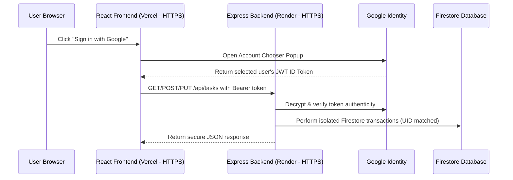

# FocusFlow — Premium Task Management Workspace
A beautifully crafted, highly secure, and modern **Task Management application** split into a dedicated frontend client and a protected REST API backend. 
Built using **React (Vite)**, **Vanilla CSS (Glassmorphism)**, and **Node.js/Express**, with client-side **Google Authentication** and server-side **Firebase Admin SDK** token validation.
---
## Architectural Workflow
FocusFlow operates in two environments: **Local Development** and **Cloud Production**. 
### 1. Production Mode (Cloud)
In production, your frontend is served securely over HTTPS from Vercel, and your backend handles data securely over HTTPS from Render.

### 2. Local Sandbox Mode (Offline Development)
If Firebase client credentials are not configured, the app automatically falls back to **Local Sandbox Mode**, saving your tasks securely inside browser `localStorage`.
---
## Folder Directory Structure
```text
task-manager/
├── README.md                     # Project documentation (This file)
│
├── frontend/                     # React Client Single Page App
│   ├── .env.example              # Client credentials template
│   ├── .env.local                # Active Client Firebase API keys (ignored by Git)
│   ├── index.html                # HTML entrypoint
│   ├── package.json              # Client dependencies & scripts
│   ├── vite.config.js            # Vite configuration with API Proxy on port 5005
│   └── src/
│       ├── main.jsx              # React app mounting point
│       ├── App.jsx               # Dashboard router & LocalStorage fallback orchestrator
│       ├── index.css             # Main stylesheet (glass variables, scrollbars & resets)
│       └── components/
│           ├── Auth.jsx          # Login view (Google Sign-In / Sandbox Entry)
│           ├── TaskForm.jsx      # Task creator form component
│           ├── TaskCard.jsx      # Status updater card
│           └── TaskList.jsx      # Columns organizer (Planned, Progress, Complete)
│
└── backend/                      # Node.js + Express API server
    ├── .env.example              # Server environment template
    ├── .env                      # Server configuration & Private Key path (ignored by Git)
    ├── package.json              # Server dependencies & scripts
    ├── server.js                 # Express initializer (CORS, JSON parsers, & routes)
    ├── config/
    │   └── firebase-admin.js     # Firebase Admin SDK bootstrapper
    ├── middleware/
    │   └── authMiddleware.js     # Express token decoding route-guard
    └── routes/
        └── tasks.js              # Firestore CRUD controller (secured via req.user.uid)
```
---
## 🛠️ Local Development Setup
Follow these steps to configure your local development environment:
### Step 1: Frontend Configurations
1. Navigate to the `frontend/` directory.
2. Rename **`.env.example`** to **`.env.local`**.
3. Go to the [Firebase Console](https://console.firebase.google.com/), select your project, go to **Project Settings**, and scroll down to add a Web App.
4. Copy the keys into your `frontend/.env.local` file:
   ```env
   VITE_FIREBASE_API_KEY=your-api-key
   VITE_FIREBASE_AUTH_DOMAIN=your-project.firebaseapp.com
   VITE_FIREBASE_PROJECT_ID=your-project-id
   VITE_FIREBASE_STORAGE_BUCKET=your-project.appspot.com
   VITE_FIREBASE_MESSAGING_SENDER_ID=your-sender-id
   VITE_FIREBASE_APP_ID=your-app-id
   ```
### Step 2: Backend Configurations & Credentials
1. Navigate to the [Firebase Console](https://console.firebase.google.com/) -> **Project Settings** -> **Service Accounts**.
2. Click **Generate New Private Key** to download a JSON credentials file.
3. Place this JSON file directly inside the **`backend/`** folder and name it **`firebase-key.json`**.
4. In the `backend/` directory, rename **`.env.example`** to **`.env`** and configure:
   ```env
   PORT=5005
   FIREBASE_SERVICE_ACCOUNT_KEY_PATH=firebase-key.json
   ```
### Step 3: Run the Application Locally
To start the frontend and backend concurrently on your computer:
#### 1. Boot the Backend Server
```bash
cd backend
npm install
npm run dev
```
*The API server will boot on port `5005`.*
#### 2. Boot the Frontend Client
In a new terminal window:
```bash
cd frontend
npm install
npm run dev
```
*Open **`http://localhost:5173/`** to view your running workspace dashboard. Both environments will talk securely without any security blocks!*
---
## 🚀 Production Cloud Deployment
To host your workspace securely in the cloud:
### 1. Deploy the Backend to Render
1. Create a free account on [Render](https://render.com/).
2. Push your `backend` folder to a GitHub repository (excluding `.env` and `firebase-key.json`).
3. Connect your repository to Render as a **Web Service**.
4. In the settings, change the **Root Directory** from `/` to **`backend`**.
5. Set the commands to:
   * **Build Command**: `npm install`
   * **Start Command**: `npm start`
6. In the **Environment** tab, add your environment variables:
   * **Key**: `FIREBASE_SERVICE_ACCOUNT_JSON`
   * **Value**: *[Paste the entire content of your `firebase-key.json` file here]*
### 2. Deploy the Frontend to Vercel
1. Push your `frontend` folder to a GitHub repository.
2. Link the repository to [Vercel](https://vercel.com/) and deploy it.
3. Go to **Settings** -> **Environment Variables** in Vercel.
4. Add all environment variables from your `.env.local` file, plus your backend Render URL:
   * `VITE_API_URL` = `https://your-backend.onrender.com` *(no trailing slash)*
   * `VITE_FIREBASE_API_KEY`
   * `VITE_FIREBASE_AUTH_DOMAIN`
   * `VITE_FIREBASE_PROJECT_ID`
   * `VITE_FIREBASE_STORAGE_BUCKET`
   * `VITE_FIREBASE_MESSAGING_SENDER_ID`
   * `VITE_FIREBASE_APP_ID`
5. Trigger a **Redeploy** on Vercel to activate the variables.
### 3. Authorize your Vercel Domain in Firebase
1. Go to your [Firebase Console](https://console.firebase.google.com/) -> **Authentication** -> **Settings** -> **Authorized Domains**.
2. Add your Vercel URL (e.g. `your-app.vercel.app`) to authorize Google Sign-In popups to run safely on your production domain.
---
## Core Technologies
* **Client Core**: React (Vite), JavaScript, Vanilla CSS (Glassmorphism).
* **Server Core**: Node.js, Express, CORS, Dotenv.
* **Database & Auth**: Firebase Web SDK v10 (Google Sign-In), Cloud Firestore, Firebase Admin SDK (token verification).
