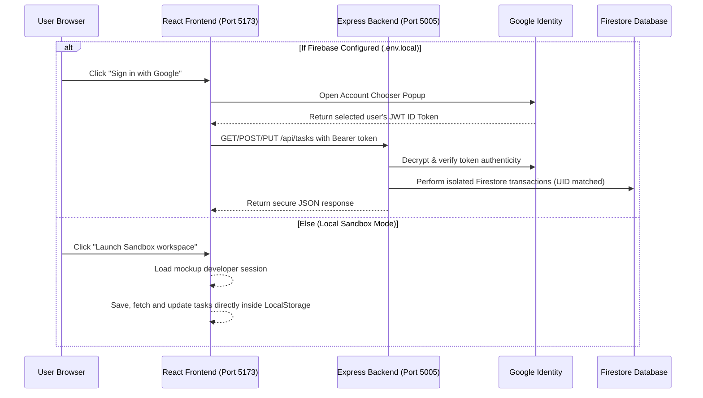

# FocusFlow — Premium Task Management Workspace

A beautifully crafted, highly secure, and modern **Task Management application** split into a dedicated frontend client and a protected REST API backend.

Built using **React (Vite)**, **Vanilla CSS (Glassmorphism)**, and **Node.js/Express**, with client-side **Google Authentication** and server-side **Firebase Admin SDK** token validation.

---

## Key Features
* 🌌 **Stunning Glassmorphism UI**: High-end dark theme designed with responsive Vanilla CSS variables, dynamic hover micro-animations, and styled status indicators.
* 🛡️ **Bearer JWT Security Architecture**: All client requests to the server carry a Firebase JWT ID Token. The server decrypts and verifies the token on every endpoint using the Firebase Admin SDK.
* 📦 **Unrestricted Database Isolation**: Firestore queries are automatically scoped under the verified user's UID—meaning users can read, create, and update only their own tasks.
* 🕹️ **Zero-Friction Sandbox Fallback**: If client Firebase credentials are not configured, the app automatically runs in **Local Sandbox Mode** using browser `localStorage`. You can build, move, and edit tasks locally without running Firebase!
* 👥 **Account Selector Support**: Prompts the Google Account Chooser on login so you can seamlessly toggle between multiple test accounts.

---

## Architectural Workflow



---

## Folder Directory Structure

```text
task-manager/
├── README.md                     # Project documentation
│
├── frontend/                     # React Client Single Page App
│   ├── .env.example              # Client credentials template
│   ├── .env.local                # Active Client Firebase API keys (ignored by Git)
│   ├── index.html                # HTML entrypoint
│   ├── package.json              # Client dependencies & scripts
│   ├── vite.config.js            # Vite configuration with API Proxy on port 5005
│   └── src/
│       ├── main.jsx              # React app mounting point
│       ├── App.jsx               # Dashboard router & LocalStorage fallback orchestrator
│       ├── index.css             # Main stylesheet (glass variables, scrollbars & resets)
│       ├── App.css               # Supporting layouts
│       ├── firebase/
│       │   └── config.js         # Client Firebase initializers with Account Chooser
│       ├── context/
│       │   └── AuthContext.jsx   # Authentication context & Bearer token fetch wrappers
│       └── components/
│           ├── Auth.jsx          # Login view (Google Sign-In / Sandbox Entry)
│           ├── TaskForm.jsx      # Task creator form component
│           ├── TaskCard.jsx      # Status updater card
│           └── TaskList.jsx      # Columns organizer (Planned, Progress, Complete)
│
└── backend/                      # Node.js + Express API server
    ├── .env.example              # Server environment template
    ├── .env                      # Server configuration & Private Key path (ignored by Git)
    ├── package.json              # Server dependencies & scripts
    ├── server.js                 # Express initializer (CORS, JSON parsers, & routes)
    ├── config/
    │   └── firebase-admin.js     # Firebase Admin SDK bootstrapper
    ├── middleware/
    │   └── authMiddleware.js     # Express token decoding route-guard
    └── routes/
        └── tasks.js              # Firestore CRUD controller (secured via req.user.uid)
```

---

## Setup & Configuration

Follow these steps to configure your environment:

### Step 1: Frontend Configurations
1. Navigate to the `frontend/` directory.
2. Rename **`.env.example`** to **`.env.local`**.
3. Go to the [Firebase Console](https://console.firebase.google.com/), select your project, go to **Project Settings**, and scroll down to add a Web App.
4. Copy the keys into your `frontend/.env.local` file:
   ```env
   VITE_FIREBASE_API_KEY=AIzaSyA1...
   VITE_FIREBASE_AUTH_DOMAIN=your-project.firebaseapp.com
   VITE_FIREBASE_PROJECT_ID=your-project-id
   VITE_FIREBASE_STORAGE_BUCKET=your-project.appspot.com
   VITE_FIREBASE_MESSAGING_SENDER_ID=1234567890
   VITE_FIREBASE_APP_ID=1:12345:web:abcd1234
   ```

### Step 2: Backend Configurations & Credentials
1. Navigate to the [Firebase Console](https://console.firebase.google.com/) -> **Project Settings** -> **Service Accounts**.
2. Click **Generate New Private Key** to download a JSON credentials file.
3. Place this JSON file directly inside the **`backend/`** folder and name it **`firebase-key.json`**.
4. In the `backend/` directory, rename **`.env.example`** to **`.env`** and configure:
   ```env
   PORT=5005
   FIREBASE_SERVICE_ACCOUNT_KEY_PATH=firebase-key.json
   ```

*Note: Both `.env` and `firebase-key.json` are already blacklisted in the local `.gitignore` files to guarantee they are never committed to public repositories.*

---

## Running Locally

Once configured, boot the client and server concurrently:

### 1. Boot the Backend Server
Navigate to the backend directory, install packages, and start the hot-reloading dev server:
```bash
cd backend
npm install
npm run dev
```
*The API server will boot on port `5005`.*

### 2. Boot the Frontend Client
In a separate terminal, navigate to the frontend directory, install packages, and start Vite:
```bash
cd frontend
npm install
npm run dev
```
*Open **`http://localhost:5173/`** to view your running workspace dashboard.*

---

## Core Technologies
* **Client Core**: React (Vite), JavaScript, Vanilla CSS.
* **Server Core**: Node.js, Express, CORS, Dotenv.
* **Database & Auth**: Firebase Web SDK v10 (Google Sign-In), Cloud Firestore, Firebase Admin SDK (token verification).
